# Cómo cargar datos de taxis en Google Cloud SQL 2.5

## Descripción general
En este lab, aprenderás a importar datos desde archivos de texto CSV a Cloud SQL y, luego, llevarás a cabo algunos análisis de datos básicos mediante consultas simples.

El conjunto de datos que se utiliza en este lab lo recopila la Comisión de Taxis y Limusinas de Nueva York y abarca los registros de todos los viajes completados en taxis amarillos y verdes en la Ciudad de Nueva York desde 2009 hasta la actualidad, así como todos los viajes en vehículos de alquiler (FHV) desde 2015 hasta la actualidad. Los registros incluyen campos que capturan la fecha y hora en que se recogieron y dejaron pasajeros, ambas ubicaciones, las distancias de los viajes, las tarifas detalladas, los tipos de tarifas, los tipos de pago y el recuento de pasajeros informado por los choferes.

Este conjunto de datos puede usarse para demostrar una amplia variedad de conceptos y técnicas sobre la ciencia de datos, y se utilizará en varios labs del programa de **Data Engineering**.

### Objetivos
Crear una instancia de Cloud SQL
Crear una base de datos de Cloud SQL
Importar datos de texto a Cloud SQL
Verificar la integridad de los datos
=======
"# Lab - C�mo cargar datos de taxis en Google Cloud SQL 2.5" 
# Cómo cargar datos de taxis en Google Cloud SQL 2.5

## Descripción general
En este lab, aprenderás a importar datos desde archivos de texto CSV a Cloud SQL y, luego, llevarás a cabo algunos análisis de datos básicos mediante consultas simples.

El conjunto de datos que se utiliza en este lab lo recopila la Comisión de Taxis y Limusinas de Nueva York y abarca los registros de todos los viajes completados en taxis amarillos y verdes en la Ciudad de Nueva York desde 2009 hasta la actualidad, así como todos los viajes en vehículos de alquiler (FHV) desde 2015 hasta la actualidad. Los registros incluyen campos que capturan la fecha y hora en que se recogieron y dejaron pasajeros, ambas ubicaciones, las distancias de los viajes, las tarifas detalladas, los tipos de tarifas, los tipos de pago y el recuento de pasajeros informado por los choferes.

Este conjunto de datos puede usarse para demostrar una amplia variedad de conceptos y técnicas sobre la ciencia de datos, y se utilizará en varios labs del programa de **Data Engineering**.

### Objetivos
Crear una instancia de Cloud SQL
Crear una base de datos de Cloud SQL
Importar datos de texto a Cloud SQL
Verificar la integridad de los datos

url: https://www1.nyc.gov/site/tlc/about/tlc-trip-record-data.page

Diccionario: https://www1.nyc.gov/assets/tlc/downloads/pdf/data_dictionary_trip_records_yellow.pdf

#
# Laboratorio

# Tarea 1: Prepara tu entorno

Crea las variables de entorno que se usarán más adelante en el lab para el ID de tu proyecto y el bucket de almacenamiento que contendrá tus datos:

```bash
export PROJECT_ID=$(gcloud info --format='value(config.project)')
export BUCKET=${PROJECT_ID}-ml

# se crea 2 variables de entorno :
# una variable de entorno llamada PROJECT_ID que almacena el ID del proyecto
# y otra variable de entorno llamada BUCKET, que combina el ID del proyecto (PROJECT_ID) con el sufijo -ml.
```

#
# Tarea 2: Crea una instancia de Cloud SQL

- crear una instancia de Cloud SQL:

```bash
gcloud sql instances create taxi \
    --tier=db-n1-standard-1 --activation-policy=ALWAYS
```

**Este proceso tardará unos minutos en completarse.**

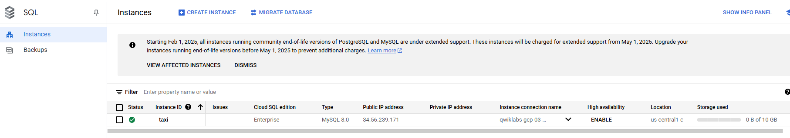

- Establece una contraseña raíz para la instancia de Cloud SQL:
```bash
gcloud sql users set-password root --host % --instance taxi \
 --password Passw0rd
```
Cuando se te solicite la contraseña, escribe `Passw0rd` y presiona **Enter** para actualizar la contraseña raíz.

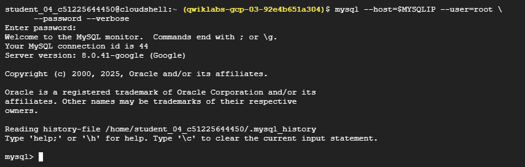

- Ahora, crea una variable de entorno con la dirección IP de Cloud Shell:
```bash
export ADDRESS=$(wget -qO - http://ipecho.net/plain)/32

# Guarda tu IP pública actual con máscara /32 en una variable llamada ADDRESS

# Para usar tu IP exacta en reglas de firewall o scripts que necesiten restringir el acceso solo a tu máquina
```
Incluye la instancia de Cloud Shell en la lista de entidades permitidas para obtener acceso de administración a tu instancia de SQL.
```bash
gcloud sql instances patch taxi --authorized-networks $ADDRESS

# Necesitás este paso para poder acceder a la base de datos desde tu entorno.
# este comando Le dice a GCP: “Permití que esta IP se conecte a la instancia SQL taxi”.
```
Cuando se te solicite, presiona **Y** para aceptar el cambio.

- Para obtener la dirección IP de tu instancia de Cloud SQL, ejecuta lo siguiente:
```bash
MYSQLIP=$(gcloud sql instances describe \
taxi --format="value(ipAddresses.ipAddress)")

# Guarda la IP pública de la instancia de Cloud SQL llamada taxi en una variable de entorno llamada MYSQLIP
```
Verifica la variable MYSQLIP:
```bash
echo $MYSQLIP

# Deberías obtener una dirección IP como resultado.
```
Para crear una tabla de viajes en taxi, accede a la interfaz de línea de comandos `mysql`:
```bash
mysql --host=$MYSQLIP --user=root \
      --password --verbose
```
Cuando se te solicite una contraseña, ingresa **Passw0rd**.

Pega lo siguiente en la línea de comandos para crear el esquema de la tabla `trips`:
```bash
create database if not exists bts;
use bts;

drop table if exists trips;

create table trips (
  vendor_id VARCHAR(16),		
  pickup_datetime DATETIME,
  dropoff_datetime DATETIME,
  passenger_count INT,
  trip_distance FLOAT,
  rate_code VARCHAR(16),
  store_and_fwd_flag VARCHAR(16),
  payment_type VARCHAR(16),
  fare_amount FLOAT,
  extra FLOAT,
  mta_tax FLOAT,
  tip_amount FLOAT,
  tolls_amount FLOAT,
  imp_surcharge FLOAT,
  total_amount FLOAT,
  pickup_location_id VARCHAR(16),
  dropoff_location_id VARCHAR(16)
);
```
En la interfaz de línea de comandos `mysql`, ingresa los siguientes comandos para verificar la importación:
```bash
describe trips;

# Muestra la estructura de la tabla trips en MySQL.
```
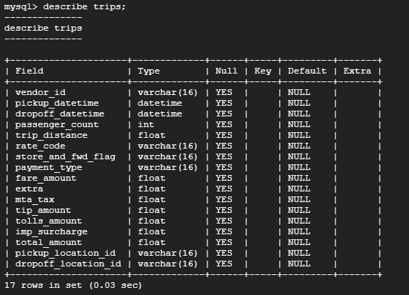

Consulta la tabla `trips`:

```bash
select distinct(pickup_location_id) from trips;

# Devuelve una lista de valores únicos (sin duplicados) de la columna pickup_location_id de la tabla trips.
```
Esto mostrará un conjunto vacío, ya que aún no hay nada en la base de datos.

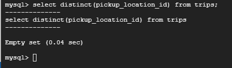


Sal de la consola interactiva de `mysql`:


```bash
exit
```
#
# Tarea 3. Agrega datos a una instancia de Cloud SQL
Ahora, copiarás los archivos CSV de los viajes en taxis de la Ciudad de Nueva York que están almacenados de manera local en Cloud Storage. Para mantener bajo el uso de recursos, solo trabajarás con un subconjunto de los datos (aproximadamente, 20,000 filas).

- Ejecuta lo siguiente en la línea de comandos:

```bash
gcloud storage cp gs://cloud-training/OCBL013/nyc_tlc_yellow_trips_2018_subset_1.csv trips.csv-1
gcloud storage cp gs://cloud-training/OCBL013/nyc_tlc_yellow_trips_2018_subset_2.csv trips.csv-2
```
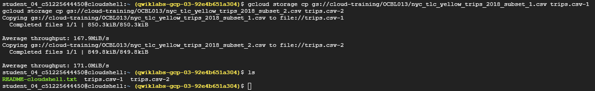

Conéctate a la consola interactiva `mysql` para cargar datos locales del archivo:
```bash
mysql --host=$MYSQLIP --user=root  --password  --local-infile

# Cuando se te solicite una contraseña, ingresa Passw0rd.
```

```bash
# selecciona la base de datos:
use bts;
```
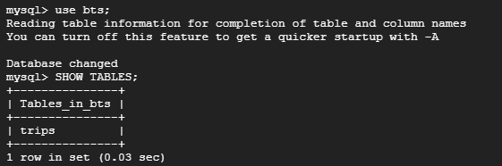

Carga los datos del archivo CSV local con `local-infile`:


```bash
LOAD DATA LOCAL INFILE 'trips.csv-1' INTO TABLE trips
FIELDS TERMINATED BY ','
LINES TERMINATED BY '\n'
IGNORE 1 LINES
(vendor_id,pickup_datetime,dropoff_datetime,passenger_count,trip_distance,rate_code,store_and_fwd_flag,payment_type,fare_amount,extra,mta_tax,tip_amount,tolls_amount,imp_surcharge,total_amount,pickup_location_id,dropoff_location_id);
```

```bash
LOAD DATA LOCAL INFILE 'trips.csv-2' INTO TABLE trips
FIELDS TERMINATED BY ','
LINES TERMINATED BY '\n'
IGNORE 1 LINES
(vendor_id,pickup_datetime,dropoff_datetime,passenger_count,trip_distance,rate_code,store_and_fwd_flag,payment_type,fare_amount,extra,mta_tax,tip_amount,tolls_amount,imp_surcharge,total_amount,pickup_location_id,dropoff_location_id);
```
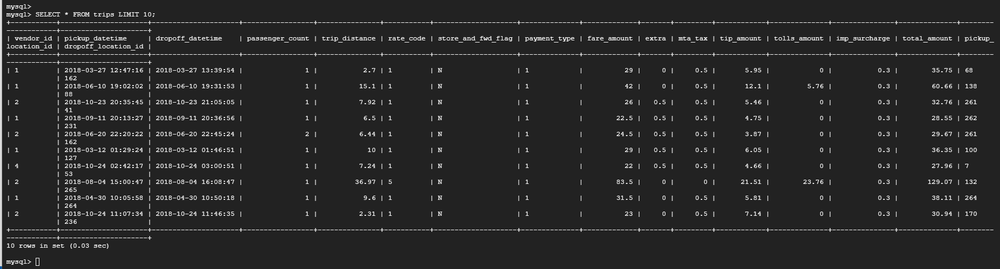

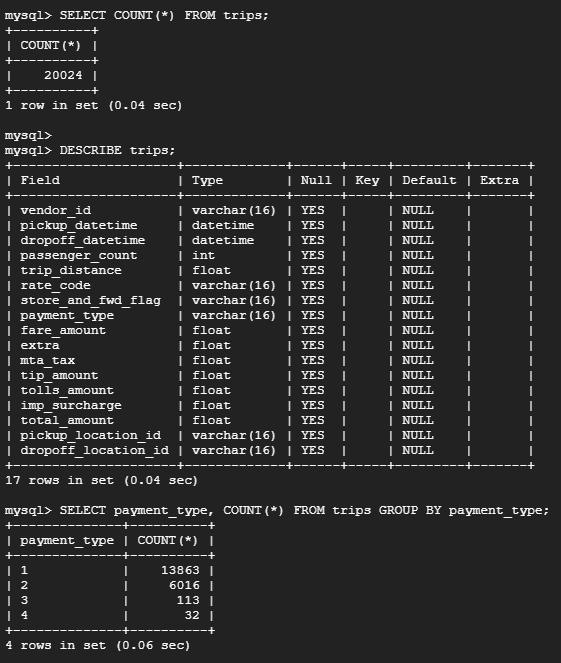


#
# Tarea 4
Cuando los datos se importan de una fuente, siempre es importante verificar su integridad. A grandes rasgos, esto significa asegurarte de que los datos cumplen con tus expectativas.

Consulta regiones de lugares de partida únicos en la tabla `trips`:

```bash
select distinct(pickup_location_id) from trips;

# Se debería mostrar un resultado de 159 IDs únicos.
```
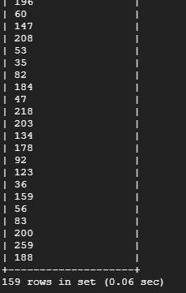

Comencemos por analizar en profundidad la columna `trip_distance`. Ingresa la siguiente consulta en la consola:
```bash
select
  max(trip_distance),
  min(trip_distance)
from
  trips;
```
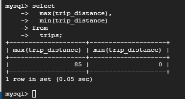

Se espera que la distancia del viaje sea mayor de 0 y menor de, digamos, 1,000 millas. El resultado de distancia máxima de 85 millas de un viaje parece razonable, pero la distancia mínima de 0 parece errónea.

¿Cuántos viajes del conjunto de datos tienen una distancia igual a 0?


```bash
select count(*) from trips where trip_distance = 0;
```
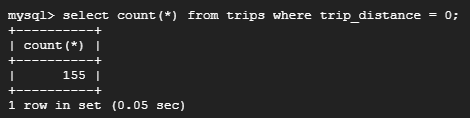


Hay 155 viajes de ese tipo en la base de datos. Estos viajes justifican una exploración más profunda. Descubrirás que estos viajes tienen importes de pago asociados que no equivalen a cero. ¿Puede que sean transacciones fraudulentas?

Veamos si podemos encontrar más datos que no cumplan con nuestras expectativas. Esperamos que la columna `fare_amount` sea positiva. Ingresa la siguiente consulta para ver si esto es cierto en la base de datos:

```
select count(*) from trips where fare_amount < 0;
```

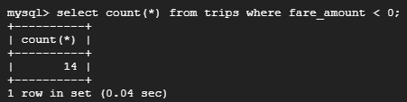


Debería haber un resultado de 14 viajes. Nuevamente, estos viajes justifican una exploración más profunda. Puede haber una explicación razonable sobre por qué las tarifas están en números negativos. Sin embargo, depende del ingeniero de datos asegurarse de que no haya errores en la canalización de datos que pudieran provocar ese resultado.

Por último, investiguemos la columna `payment_type`


```
select
  payment_type,
  count(*)
from
  trips
group by
  payment_type;
```

Los resultados de la consulta indican que hay cuatro tipos de pago diferentes, que se detallan a continuación:

- Tipo de pago = 1 tiene 13,863 filas
- Tipo de pago = 2 tiene 6,016 filas
- Tipo de pago = 3 tiene 113 filas
- Tipo de pago = 4 tiene 32 filas

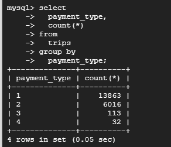


```
exit
```
#
## 📌 Autor

Este repositorio fue creado y documentado por **German Leventan Sago**.
 
📅 Fecha: Junio 2025  
🔗 Perfil de GitHub: [github.com/germanleventan](https://github.com/GermanPLS)
>>>>>>> dc17380 (Actualización del README y nuevas imágenes)
